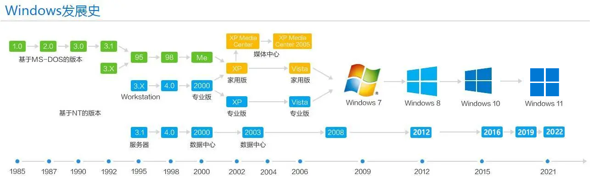
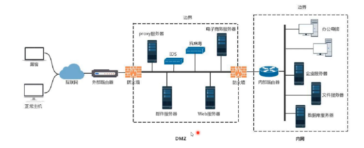
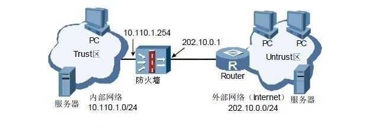
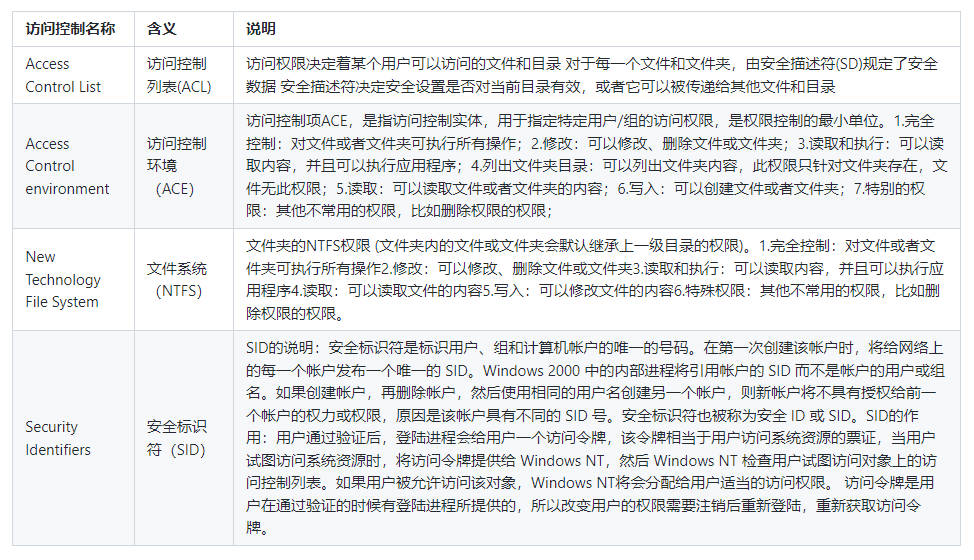
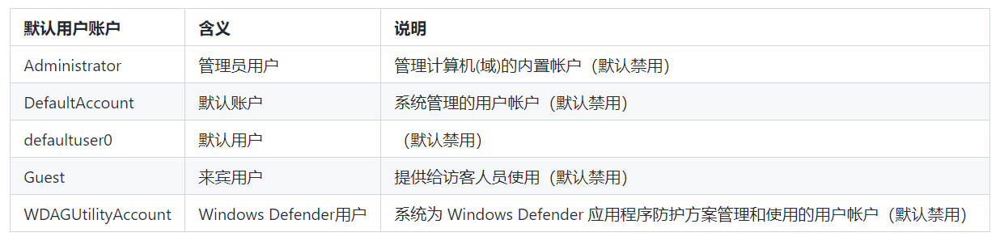
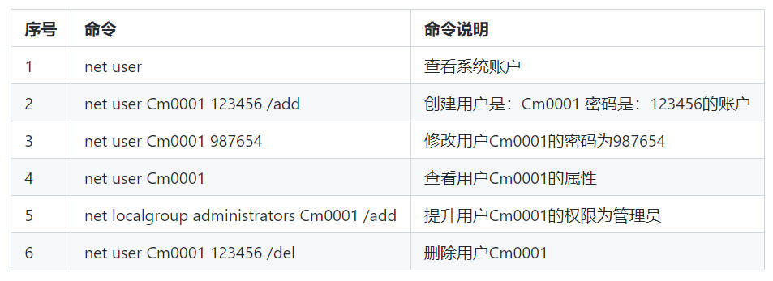
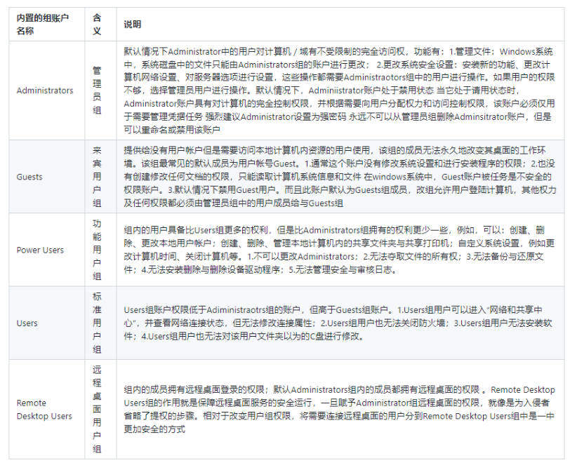

# OM-2.2-Windows桌面安全配置

本章节，一起来了解windows系统的桌面安全配置相关知识，主要从防火墙、使用账户和权限管理、安装杀毒软件这几个方面进行介绍，通过学习安全配置，保护系统免受恶意软件和网络攻击。  

--

## 一、简介
### 1.1 windows版本简介  

--

  

--

下图可以清晰地看到各个版本的市场份额占比：   

  

---

## 二、防火墙简介

目的：了解防火墙的功能、防火墙的工作原理、windows防火墙的使用配置。  

---

### 2.1 防火墙的功能

   
* 过滤非安全网络访问。
* 限制网络访问。
* 网络访问审计。  

---

### 2.2 防火墙的工作原理
   
防火墙根据一定的安全规则来控制流过防火墙的网络包，如禁止或转发，能够屏蔽被保护网络内部的信息、拓扑结构和运行状况，从而起到网络安全屏障的作用。防火墙一般用来将内部网络与因特网或者其它外部网络相互隔离，限制网络互访，保护内部网络的安全。  


--

#### 2.2.1 防火墙类型与实现技术  
防火墙的实现技术主要有包过滤、状态检测、应用服务代理、网络地址转换、协议分析、深度包检查等。本节主要介绍防火墙普遍采用的包过滤技术、状态检测技术和代理服务技术。 

--

##### 2.2.1.1 包过滤技术
包过滤是在IP层实现的防火墙技术，典型的过滤规则表示格式由“规则号、匹配条件、匹配操作”三部分组成，一般的包过滤防火墙都用源IP地址、目的IP地址、源端口号、目的端口号、协议类型（UDP、TCP、ICMP）、通信方向、规则运算符来描述过滤规则条件。  

--

##### 2.2.1.2 状态检测技术  
<p align="left">（1）接收到数据包。 </p>
<p align="left">（2）检查数据包的有效性，若无效，则丢掉数据包并审计。  </p>
<p align="left">（3）查找会话表；若找到，则进一步检查数据包的序列号和会话状态，如有效，则进行地址转换和路由，转发该数据包；否则，丢掉数据包并审计。 </p>
<p align="left">（4）当会话表中没有新到的数据包信息时，则查找策略表，如符合策略表，则增加会话条目到会话表中，并进行地址转换和路由，转发该数据包；否则，丢掉该数据包并审计。 </p>
 

--

##### 2.2.1.3 应用服务代理技术

应用服务代理防火墙扮演着受保护网络的内部网络主机和外部网络主机的网络通信连接“中间人”角色，采用代理服务技术的防火墙简称为代理服务器，它能提供应用级的网络安全访问控制。代理服务器按照所代理的服务可分为FTP代理、Telnet代理、Http代理、Socket代理、邮件代理等。 

---

### 2.3 windows防火墙的部署和应用
适用于：✅ Windows 11, ✅ Windows 10, ✅ Windows Server 2022, ✅ Windows Server 2019, ✅ Windows Server 2016 

--

#### 2.3.1 windows防火墙简介 

--

Windows 防火墙是基于主机的防火墙，它包含在操作系统中，在所有 Windows 版本上默认启用。Windows 防火墙支持 Internet 协议安全性 (IPsec) ，可以使用它从任何尝试与你的设备通信的设备进行身份验证。需要身份验证时，无法作为受信任设备进行身份验证的设备无法与你的设备通信。Windows 防火墙还适用于网络位置感知，以便它可以应用适合设备所连接到的网络类型的安全设置。  

--

#### 2.3.2 windows防火墙配置文件  
* 域网络：   
域网络配置文件在检测到域控制器的可用性时，会自动应用于已加入 `Active Directory` 域的设备，无法手动设置此网络配置文件。  
* 专用网络：  
专用网络配置文件专为专用网络（如家庭网络）设计。管理员可以在网络接口上手动设置它。  
* 公共网络：  
公共网络配置文件在设计时考虑了公共网络（如 Wi-Fi 热点、咖啡店、机场、酒店等）的安全性。它是身份不明网络的默认配置文件。 

--

#### 2.3.3 windows防火墙规则  

防火墙规则提供了广泛的条件选择来标识流量，包括：  
* 应用程序、服务或程序名称
* 源和目标 IP 地址
* 可以使用动态值，例如默认网关、DHCP 服务器、DNS 服务器和本地子网
* 协议名称或类型。 对于传输层协议 TCP 和 UDP，可以指定端口或端口范围。 对于自定义协议，可以使用表示 IP 协议的 0 到 255 之间的数字
* 接口类型
* ICMP/ICMPv6 流量类型和代码

--

* Windows 系统默认的规则：默认阻止入站连接，默认允许出站连接。  
* Windows 防火墙的规则扫描有它自己特定的顺序，其优先级为：只允许安全连接>阻止连接>允许连接>默认规则（如果没有设置，那就是默认阻止）。  
* 出站规则：出站规则来限制对外访问。  
* 入站规则：入站规则是用来限制远程主机访问本机的服务的。    
具体的配置规则的步骤可参考官方文档[使用组策略配置规则](https://learn.microsoft.com/zh-cn/windows/security/operating-system-security/network-security/windows-firewall/configure?cid=kerryherger)

---

### 2.4 windows防火墙简易测试，以MS17-010为例 

* 受影响的版本：
目前已知受影响的 Windows 版本包括但不限于：WindowsNT，Windows2000、Windows XP、Windows 2003、Windows Vista、Windows 7、Windows 8，Windows 2008、Windows 2008 R2、Windows Server 2012 SP0  

---

### 2.5 防火墙常见厂商  
```
1.Juniper/NetScreen  
NetScreen由三位留美的清华学子创建，其防火墙和VPN产品无论从性能指标还是质量上都位居世界前列。 

2.Cisco  
非常有名的网络公司，提供动态或者静态的网络地址解析（NAT）和端口地址解析（PAT）功能。用户可灵活地实现联网功能而且与PPPoE(PPP Over Ethernet)网络兼容。管理方便、快捷，手段灵活。提供了较强的可管理性和可审计性。  

3.CheckPoint  
CheckPoint公司是全球首屈一指的互联网安全解决方案供应商，是Internet安全领域的全球领先企业，在全球VPN及防火墙市场上居于领导地位。

4.Fortinet  
Fortinet是新一代网络实时安全防御网关的技术引领者。首家推出基于ASIC硬件体系结构的FortiGate防火墙。该系列产品已获得国际计算机安全协会实验室的防病毒、IPSec、NIDS和防火墙四项认证证书，是全球唯一同时拥有这四项证书的厂家。 

5.WatchGuard  
WatchGuard公司是全球排名前五位的专业生产防火墙的公司之一。WatchGuard公司以生产即插即用Internet安全设备 `Firebox` 系列和相应的服务器安全软件而闻名于世，WatchGuard在全球首创了专用安全系统；首家将应用层安全结合到防火墙系统中；首创了可全面升级的整合安全网关；首创可全面升级的统一威胁管理（UTM）产品。  

6.安氏  

安氏是一家以技术著称的专业信息安全公司，它成功开发了全新一代安全管理解决方案——安全运行中心（Security Operation Center, 简称SOC）。安氏公司在电信、金融等行业率先推出了整体信息安全管理方案，其主要产品是 `领信` 系列安全产品。  

7.天融信  

天融信公司于1996年推出了中国第一套自主版权的防火墙产品，具有填补国内空白的重要意义。随后几年又推出了VPN、IDS、过滤网关、安全审计、安全管理等一系列安全相关产品。2001年组织并构建了TOPSEC联动协议安全标准，提出了一套集各类安全产品和集中管理、集中审计为一体的TOPSEC安全解决方案。

8.东欧  

东软是中国领先的软件与解决方案提供商。东软的NetEye防火墙(FW)产品采用独创的基于状态包过滤的 `流过滤` 体系结构，保证了从数据链路层到应用层的完全高性能过滤，并可以进行应用级插件的及时升级和安全威胁的有效防护，实现网络安全的动态保障NetEye防火墙采用NP架构，运行于NetEye安全操作系统之上，具有高吞吐量、低延迟、零丢包率和强大的缓冲能力。同时NetEye防火墙集成VPN功能，简单及人性化的虚拟通道设置，有效提高了VPN的部署灵活性、可扩展性，降低了部署维护的成本。  


9.启明星辰  

采用高性能X86硬件架构 一体化网关技术，1996年成立的启明星辰，承担国家级重点项目企业，拥有国家级网络安全技术研发基地。2003年，成为国内仅有的两家可以查看微软Windows操作系统源代码厂商之一。目前，产品涉及从大型企业、电信级千兆骨干网到小型分支机构的百兆型网络的USG10个产品。  


10.联想网御  

联想网御1999年进入信息安全行业，拥有众多的核心技术、专利50项，涵盖全系列防火墙、×××、UTM、IDS、IPS、防病毒网关、安全隔离网闸、安全管理共计8个大类，350多款产品，并参与和制定了多项国家安全等级保护制度。联想网御防火墙分为三大系列：Spuer V、Power V、Smart V，共计40多款。拥有创新的VSP、USE、MRP等安全关键技术，其产品在众多领域已经部署了4万台以上，市场占有率名列前茅。  


11.华为

技术为主，质量有保障。华为业务领域涉猎众多，在网络安全方面，Eudemon 防火墙系列产品基于电信级的硬件平台以及专用VRP软件平台。基于网络处理器NP的高速防火墙Eudemon 300/500/1000和专业的硬件平台以及VRP软件平台的Eudemon 100E/200/200S。  
```

---

## 三、权限管理简介
目的：本节介绍 Windows 的权限管理，如何创建用户，添加用户到组等技巧。
* 实现权限管理的三个设计：
    * "安全标识符"（Security Identifier,SID）
    * "访问控制列表"（Access Control List，ACL）
    * 安全主体（Security Principal）

---

### 3.1安全标识符SID
系统是通过SID对用户进行识别的，而不是很多用户认为的"用户名称"。
查看用户、组、服务或计算机的SID值，可以使用 "Whoami"工具来执行:
```shell
#查看系统当前用户的SID
whoami /user

#查看所有用户的SID
wmic useraccount get name,sid
```

### 3.2 访问控制  
windows的访问控制：    

### 3.3 安全主体 

### 3.1 用户与组介绍  

--

Windows的用户帐户是对计算机用户身份的识别，且本地用户帐户和密码信息是存储在本地计算机上的安全账户管理器SAM(Security Accounts Manager)负责数据库的控制和维护；SAM对应的进程：lsass.exe （Local Security Authority Process）。通过本地用户和组，可以为用户和组分配权利和权限，从而限制用户和组执行某些操作的能力。不同的用户身份拥有不同的权限，每个用户包含一个名称和一个密码，用户帐户拥有唯一的安全标识符(Security Identifier，SID)。

--

组账户是一些用户的集合；且组内的用户自动拥有组所设置的权限。  
* 组账户是用户账户的集合，用于组织用户账户；  
* 为一个组授予权限后，则该组内的所有成员用户自动获得改组的权限；  
* 一个用户账户可以隶属于多个组，而这个用户的权限就是所有组的权限的合并集。  

---

### 3.2 用户账户与组账户  

--

#### 3.2.1 用户账户

Windows的默认用户账户用于特殊用途，一般不用更修改其权限。拥有的权限大小：System > Administrator > Uaer > Guest：  
  

--

#### 3.2.2 用户账户的查看、创建和提升权限



--

#### 3.2.3 组账户


--

#### 3.2.4 组的查看、创建和删除  

```
#新建一个testgroup的组
net localgroup testgroup /add   
#创建用户是：Cm0001 密码是：123456的账户
net user Cm0001 123456 /add   
#将用户Cm0001加入testgroup组中
net localgroup testgroup Cm0001 /add   
#查看testgroup组内的成员
net localgroup testgroup  
#将用户Cm0001从testgroup组中移除
net localgroup testgroup Cm0001 /del 
#删除testgroup组
net localgroup testgroup /del   
将用户hack加入remote desktop users组中
net localgroup "remote desktop users" hack /add 
查看remote desktop users组内的成员
net localgroup "remote desktop users"  
将用户hack从remote desktop users组中移除
net localgroup "remote desktop users" hack /del  
```


---

### 3.4 用户账户控制（UAC）

用户帐户控制（User Account Control，简称：UAC）是微软公司在其Windows Vista及更高版本操作系统中采用的一种控制机制。UAC要求用户在执行可能影响计算机运行的操作或执行更改影响其他用户的设置的操作之前，提供一个确认的对话框窗口，使用户可以在执行之前对其进行验证，UAC可以帮助防止恶意软件和间谍软件在未经许可的情况下在计算机上进行安装或对计算机进行更改。  

---

## 四、杀毒软件简介
目的：了解杀毒软件的运行原理，了解windows内置杀毒软件windows defender，了解市场上的杀毒软件。  

---

### 4.1 杀毒软件的重要性
杀毒软件在当前计算机安全中具有不可替代的重要性，它能够保护计算机系统免受恶意软件和网络攻击的侵害，提升系统的安全性和稳定性，保护用户的个人隐私和数据安全。安装并定期更新杀毒软件是维护计算机安全的必要措施之一：  
* 恶意软件防护  
* 实时保护 
* 安全漏洞修补


---

### 4.2 Windows Defender简介

* 实时保护：`Windows Defender` 的核心功能是提供实时保护，即时检测并阻止恶意软件的执行。  
* 完整系统扫描：用户可以随时进行全盘扫描，确保系统中没有潜在的威胁。  
* 自定义扫描：除了全盘扫描外，`Windows Defender` 还支持用户自定义扫描，可选择特定文件夹或文件进行检查。  
* 防火墙和网络保护：`Windows Defender` 还包含防火墙和网络保护功能。  
* 性能和健康报告：用户可以查看性能和健康报告，以及 `Windows Defender` 对潜在威胁的处理情况。  

---

### 4.3 打开或者关闭windows defender   
默认情况下， `Windows Defender` 处于打开的状态。大多数第三方的杀毒软件都可以识别并代替它。  

---

### 4.4 杀毒软件推荐  
很多朋友购买新电脑的第一件事，恐怕就是安装各种管家和杀毒软件而不是使用内置的 `Windows Defender` 。很多人不喜欢 `Windows Defender` 的原因其实很简单，此前大家习惯下载盗版软件，比如破解游戏、破解工具等，这些软件很容易被 `Windows Defender` 视为病毒并查杀。[2024年Windows Defender还好使吗](https://zh.safetydetectives.com/blog/windows-defender%E5%AF%B9%E6%AF%94%E5%85%A8%E9%9D%A2%E9%98%B2%E7%97%85%E6%AF%92%E8%BD%AF%E4%BB%B6/)这篇文章对`Windows Defender` 以及其他杀毒软件的优缺点进行了较为详细的对比，仅作参考（内含广告）。想要了解更多信息也可以参考知乎回答：[Windows Defender 是否比火绒等安全软件更好](https://www.zhihu.com/question/510026987)。  